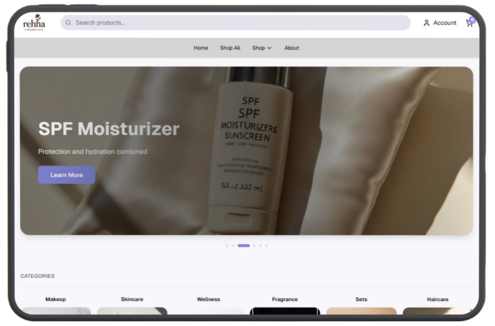

<div align="center" style="display: flex; align-items: center; justify-content: center;">
  
</div>

---

## Live Demo  
**REHHA Website:** https://rehha.sujandas.info/

---

## Preview  


---

## Overview

**REHHA** is a modern and fully responsive beauty & cosmetics e-commerce platform built using **Next.js 16**, **React 19**, **TypeScript**, and **Tailwind CSS 4**.

The platform provides a luxurious shopping experience with category-based browsing, dynamic product detail pages, filtering, sliders, reusable UI components, optimized assets, and JSON-based product data.

---

## Key Features

* Luxury and premium UI/UX design  
* Fully responsive layout for mobile, tablet, and desktop  
* Dynamic product pages with images, details, badges, and reviews  
* Category-based navigation (Skincare, Makeup, Haircare, Fragrance, Wellness, Sets)  
* Advanced filtering and sorting options  
* Smooth hero sliders and product carousels  
* Optimized images and fast rendering  
* Light/dark theme support  
* Clean, modular, scalable architecture  
* JSON-based product structure  
* Search-ready, SEO-friendly layout  

---

## Tech Stack

* Next.js 16  
* React 19  
* TypeScript  
* Tailwind CSS 4  
* shadcn/ui  
* Radix UI  
* Framer Motion  
* Lucide Icons  

---

## Installation & Setup

```bash
# Clone the project
git clone https://github.com/devsujandas/rehha.git
cd REHHA

# Install dependencies
npm install

# Start development server
npm run dev
````

Visit the project at:

```
http://localhost:3000
```

---

## Project Structure

```
rehha/
├── app/                              # Next.js App Router pages
│   ├── page.tsx                      # Homepage
│   ├── layout.tsx                    # Root layout with metadata
│   ├── globals.css                   # Global Tailwind styles
│   │
│   ├── about/
│   │   └── page.tsx                  # About Us page
│   ├── contact/
│   │   └── page.tsx                  # Contact Us page
│   ├── support/
│   │   └── page.tsx                  # Support/FAQ page
│   │
│   ├── shop/
│   │   └── page.tsx                  # Main shop page
│   ├── shop-all/
│   │   └── page.tsx                  # All products page
│   ├── categories/[slug]/
│   │   └── page.tsx                  # Dynamic category pages
│   │
│   ├── skincare/
│   │   └── page.tsx                  # Skincare category
│   ├── makeup/
│   │   └── page.tsx                  # Makeup category
│   ├── haircare/
│   │   └── page.tsx                  # Haircare category
│   ├── fragrance/
│   │   └── page.tsx                  # Fragrance category
│   ├── wellness/
│   │   └── page.tsx                  # Wellness category
│   ├── sets/
│   │   └── page.tsx                  # Product sets category
│   │
│   ├── products/
│   │   ├── [id]/                     # Product detail page
│   │   │   └── page.tsx
│   │   ├── eye-cream-collection/
│   │   ├── hydrating-face-serum/
│   │   ├── luxe-facial-mask/
│   │   ├── night-renewal-serum/
│   │   ├── rose-oil-elixir/
│   │   └── spf-moisturizer/          # Showcase product pages
│   │
│   ├── cart/
│   │   └── page.tsx                  # Shopping cart
│   ├── checkout/
│   │   └── page.tsx                  # Checkout
│   │
│   ├── login/
│   │   └── page.tsx                  # Login page
│   ├── signup/
│   │   └── page.tsx                  # Signup page
│   ├── account/
│   │   └── page.tsx                  # User account
│   │
│   └── support/
│       └── loading.tsx               # Support loading state
│
├── components/                       # Reusable components
│   ├── header.tsx                    # Main header
│   ├── footer.tsx                    # Footer
│   ├── hero.tsx                      # Hero section
│   ├── hero-slider.tsx               # Hero slider
│   ├── hero-card.tsx                 # Hero card
│   │
│   ├── banner-carousel.tsx           # Auto-play carousel
│   ├── auto-carousel-section.tsx     # Auto carousel section
│   ├── product-slider.tsx            # Product slider
│   │
│   ├── categories.tsx                # Category grid
│   ├── featured-products.tsx         # Featured products
│   ├── product-card.tsx              # Product card
│   ├── product-slider.tsx            # Product carousel
│   │
│   ├── mixed-cards-section.tsx       # Mixed card layout
│   ├── vertical-cards-section.tsx    # Vertical cards
│   ├── small-square-cards.tsx        # Small cards
│   │
│   ├── filter-bar-section.tsx        # Filter bar
│   ├── social-banner.tsx             # Social banner
│   │
│   ├── skincare-content.tsx
│   ├── makeup-content.tsx
│   ├── haircare-content.tsx
│   ├── fragrance-content.tsx
│   ├── wellness-content.tsx
│   ├── sets-content.tsx
│   │
│   ├── theme-provider.tsx            # Theme provider
│   │
│   └── ui/                           # shadcn/ui components
│       ├── button.tsx
│       ├── card.tsx
│       ├── input.tsx
│       ├── select.tsx
│       ├── dialog.tsx
│       ├── drawer.tsx
│       ├── carousel.tsx
│       ├── spinner.tsx
│       ├── tabs.tsx
│       ├── accordion.tsx
│       ├── badge.tsx
│       ├── avatar.tsx
│       ├── pagination.tsx
│       ├── form.tsx
│       ├── checkbox.tsx
│       ├── radio-group.tsx
│       ├── toast.tsx
│       ├── alert.tsx
│       ├── skeleton.tsx
│       └── [... other UI components]
│
├── lib/
│   ├── products.ts                   # Product data utilities
│   └── utils.ts                      # Helper functions
│
├── hooks/
│   ├── use-mobile.ts                 # Mobile device detection
│   └── use-toast.ts                  # Toast hook
│
├── public/
│   ├── images/
│   │   ├── luxury-purple-cosmetic-serum-bottle.jpg
│   │   ├── luxury-purple-face-mask-jar.jpg
│   │   ├── luxury-white-pearl-cream-jar.jpg
│   │   ├── carousel-*.jpg
│   │   ├── category-*.jpg
│   │   ├── about-hero.jpg
│   │   ├── about-story.jpg
│   │   ├── team-*.jpg
│   │   └── [... product images]
│   ├── data/
│   │   ├── Skincare.json
│   │   ├── Makeup.json
│   │   ├── Haircare.json
│   │   ├── Fragrance.json
│   │   ├── Wellness.json
│   │   └── Sets.json
│   ├── icon.svg
│   ├── apple-icon.png
│   └── [... other icons]
│
├── scripts/
│
├── next.config.mjs
├── tsconfig.json
├── tailwind.config.js
├── postcss.config.mjs
├── components.json
├── package.json
├── README.md
├── .gitignore
└── pnpm-lock.yaml
```

---

## Deployment

REHHA supports deployment on:

* Vercel (recommended)
* Netlify
* Cloudflare Pages

Just connect the repository and deploy.

---

## License

REHHA is a proprietary commercial project.
Redistribution or usage without permission is not allowed.
Check the `LICENSE` file for details.

---

## Author

<div align="center">

[](https://github.com/devsujandas)
[](https://sujandas.info)
[](https://instagram.com/devsujandas)
[](https://linkedin.com/in/devsujandas)

</div>

<div align="center">
Thank you for exploring REHHA. Feel free to star the repository or share your feedback.
</div>


---
